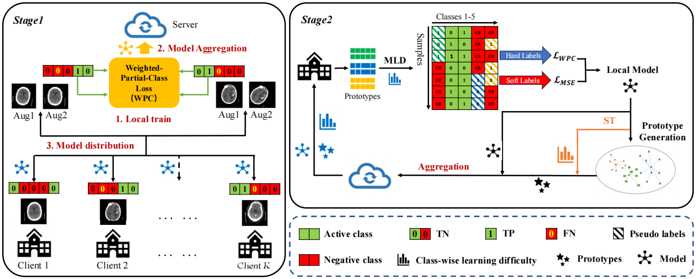

# FedMLP
This is the official implementation for the paper: "FedMLP: Federated Multi-Label Medical Image Classiffcation under Task Heterogeneity", which is accepted at MICCAI'24 (Early Accept, top 11% in total 2869 submissions).

  

## Introduction
Cross-silo federated learning (FL) enables decentralized organizations to collaboratively train models while preserving data privacy and has made signiffcant progress in medical image classiffcation. One common assumption is task homogeneity where each client has access to all classes during training. However, in clinical practice, given a multi-label classiffcation task, constrained by the level of medical knowledge and the prevalence of diseases, each institution may diagnose only partial categories, resulting in task heterogeneity. How to pursue effective multi-label medical image classiffcation under task heterogeneity is under-explored. In this paper, we ffrst formulate such a realistic label missing setting in the multi-label FL domain and propose a two-stage method FedMLP to combat class missing from two aspects: pseudo label tagging and global knowledge learning. The former utilizes a warmed-up model to generate class prototypes and select samples with high conffdence to supplement missing labels, while the latter uses a global model as a teacher for consistency regularization to prevent forgetting missing class knowledge. Experiments on two publicly-available medical datasets validate the superiority of FedMLP against the state-of-the-art both federated semi-supervised and noisy label learning approaches under task
heterogeneity.

## Related Work
- RSCFed [[paper](https://openaccess.thecvf.com/content/CVPR2022/papers/Liang_RSCFed_Random_Sampling_Consensus_Federated_Semi-Supervised_Learning_CVPR_2022_paper.pdf)] [[code](https://github.com/XMed-Lab/RSCFed)]
- FedNoRo [[paper](https://arxiv.org/pdf/2305.05230)] [[code](https://github.com/wnn2000/FedNoRo)]
- CBAFed [[paper](https://openaccess.thecvf.com/content/CVPR2023/papers/Li_Class_Balanced_Adaptive_Pseudo_Labeling_for_Federated_Semi-Supervised_Learning_CVPR_2023_paper.pdf)] [[code](https://github.com/minglllli/CBAFed)]

## Dataset 
Please download the ICH dataset from [kaggle](https://www.kaggle.com/c/rsna-intracranial-hemorrhage-detection) and preprocess it follow this [notebook](https://www.kaggle.com/guiferviz/prepare-dataset-resizing-and-saving-as-png). Please download the ChestXray14 dataset from this [link](https://nihcc.app.box.com/v/ChestXray-NIHCC).

## Requirements
We recommend using conda to setup the environment, See the `requirements.txt` for environment configuration.

## Citation
If this repository is useful for your research, please consider citing:

## Contact
For any questions, please contact 'zbsun@hust.edu.cn'.
